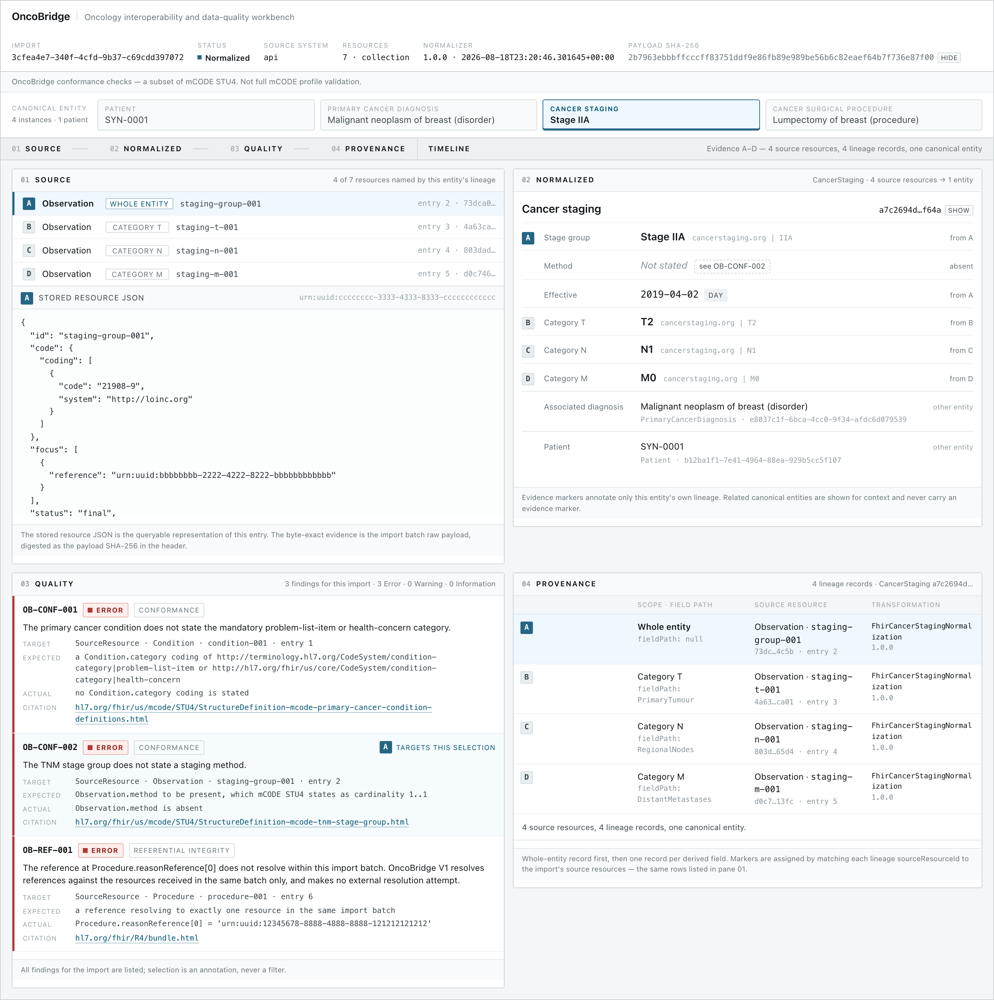
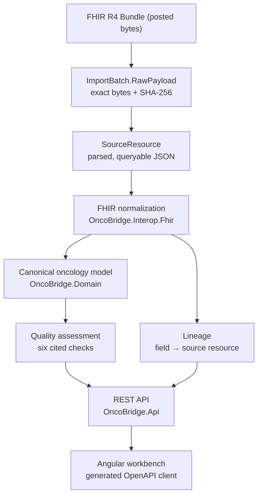
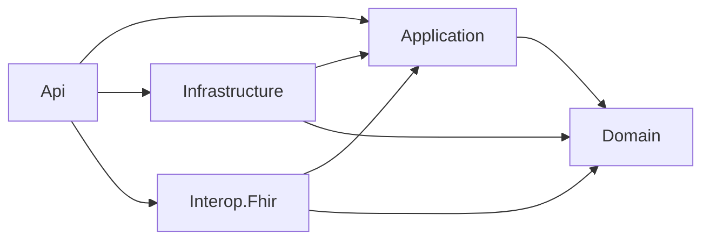
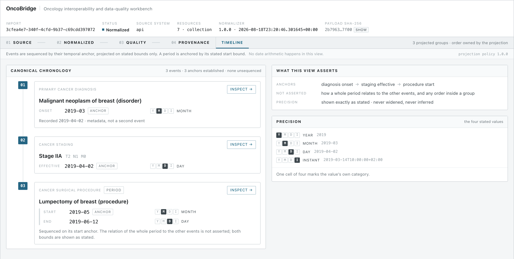

# OncoBridge

An oncology interoperability and data-quality workbench. It ingests synthetic **FHIR R4** bundles,
preserves them byte for byte as evidence, normalizes selected oncology concepts into a canonical
model that contains no FHIR types, evaluates deterministic quality checks against cited
specification statements, and exposes the provenance chain from every normalized field back to the
source resource it was read from.

It is a local V1 workbench for **synthetic data**. It uses **mCODE STU4 (v4.0.0)** as a conformance
yardstick, not as a validator: findings come from **OncoBridge conformance checks — a subset of
mCODE STU4**, and the tool never claims a bundle is "mCODE validated".



## Run it

You need **Git** and **Docker** with Compose. Nothing else — no local PostgreSQL, .NET SDK, Node, or
manual migration step.

```bash
docker compose up --build
```

Then open **<http://localhost:8080>** and import
`test-data/synthetic/phase4/bundle-acceptance-defects.json`.

Only the web container is published to the host; the API and PostgreSQL stay on the Compose
network, and the web server reverse-proxies `/api` to the API.

```bash
docker compose down      # stop, keep the database volume
docker compose down -v   # stop and delete the database volume for a clean reset
```

## What the demo proves

The acceptance bundle is deliberately imperfect. Importing it demonstrates, in one screen, the
things this project exists to show:

- **A FHIR graph becomes one canonical aggregate.** Four separate `Observation` resources — a TNM
  stage group plus its T, N and M members — normalize into a single `CancerStaging` entity holding
  `Stage IIA` with categories `T2`, `N1`, `M0`.
- **Nothing is lost in the collapse.** All four contributing resources remain, and four lineage
  records name which source produced which field.
- **Quality is reported, not enforced.** Three findings are raised, each with the specification
  statement it was derived from. The import still succeeds; a defective record is data, not a crash.
- **The received bytes are still the received bytes.** The payload SHA-256 shown in the header is
  computed over exactly what was posted.
- **Precision is never invented.** `2019-03`, `2019-04-02` and `2019-05 → 2019-06-12` keep the
  precision the source stated, and the timeline refuses to assert an order it cannot prove.

## Architecture



The module boundary is the point, and it is enforced by tests rather than by convention:



- **`OncoBridge.Domain`** — plain C# with no project references at all. No FHIR types, no EF Core,
  no HTTP. The oncology concepts, the temporal model and the quality vocabulary live here.
- **`OncoBridge.Application`** — use cases and read projections over the domain, expressed against
  interfaces it owns.
- **`OncoBridge.Interop.Fhir`** — the only project that knows FHIR exists. It parses bundles,
  normalizes them into canonical entities, records lineage, and runs the source-facing checks.
- **`OncoBridge.Infrastructure`** — EF Core, PostgreSQL, migrations.
- **`OncoBridge.Api`** — HTTP contracts, minimal-API endpoints, OpenAPI.
- **`src/oncobridge-web`** — Angular workbench consuming a client generated from the OpenAPI
  document. No hand-written HTTP models.

`DomainBoundaryTests` and `PublicSurfaceTests` fail the test run if a FHIR type leaks into the
domain, if a project gains a reference it should not have, or if the normalizer's entry point stops
speaking domain types only.

## The canonical model

V1 normalizes exactly four concepts. Adding a fifth is a decision, not an afternoon:

| Concept | Derived from | Occurrence |
|---|---|---|
| `Patient` | `Patient` | birth date (variable precision) |
| `PrimaryCancerDiagnosis` | `Condition` | onset — date or period |
| `CancerStaging` | a TNM stage group `Observation` **plus its T/N/M members** | effective date |
| `CancerSurgicalProcedure` | `Procedure` | performed — date or period |

The staging transformation is the one worth looking at. In FHIR the information is a small graph:
a stage group observation with `hasMember` references to three category observations. In the
canonical model it is **one `CancerStaging` aggregate** with a stage group and an ordered T/N/M
category list. The graph is not flattened away — every contributing `Observation` is still stored as
a source resource, and the lineage table records which one produced the stage group, and which
produced each category.

## Raw source integrity

Three storage concepts are deliberately kept apart:

| Field | What it is |
|---|---|
| `ImportBatch.RawPayload` | the exact uploaded bytes, `bytea` |
| `ImportBatch.ContentHash` | SHA-256 computed over exactly those bytes |
| `SourceResource.ResourceJson` | a parsed, queryable `jsonb` copy of one entry |

`ResourceJson` is a **derived convenience, not the audit record**. `jsonb` may reorder object keys,
drop insignificant whitespace and rewrite escapes: it preserves meaning, not bytes, and cannot
reproduce the digest. The inspector says so on screen rather than letting the reader assume
otherwise. See [ADR-0006](docs/adr/0006-postgresql-and-raw-payload-storage.md).

## Temporal model

FHIR dates are variable precision, and collapsing them into `DateTime` would invent information the
source never stated. OncoBridge keeps `2019`, `2019-03`, `2019-03-14` and
`2019-03-14T10:00:00+02:00` as distinct stated values, each carrying its own precision.

Comparison therefore has four outcomes — `Before`, `After`, `Same` and `Indeterminate` — and forms a
**partial order**, so partial dates cannot simply be sorted. `2019` versus `2019-03` is
`Indeterminate`: March 2019 falls inside 2019, and nothing in the record settles the order.



The timeline is a **server-side projection**, not client-side date logic. The response carries the
policy sentence it was built under, and the view renders that sentence verbatim so the screen cannot
quietly disagree with the server. Where precision cannot prove an order, the projection says so
instead of inventing one:

- **Shared temporal anchor** — events whose anchors compare `Same` share a group, and no
  before/after order is asserted inside it.
- **Order not established** — the stated precision admits no definite ordering between these events.
- **Unsequenced** — an event with no usable anchor keeps every bound it did state, carries the
  reason it could not be placed, and is never given a sequence number.

A period is anchored by its **stated start bound**; the end bound never anchors an event, and the
response names which bound the anchor came from rather than leaving the client to guess. See
[ADR-0005](docs/adr/0005-variable-precision-temporal-model.md) and
[ADR-0011](docs/adr/0011-timeline-temporal-projection-policy.md).

## Quality checks

Six checks are implemented in V1. Each carries a citation, an `expected` and an `actual`, so a
reviewer can check the claim against the specification rather than trusting the tool.

**Source and conformance checks** — evaluated against the FHIR resources as received:

| Check | Category | Severity | What it reports |
|---|---|---|---|
| `OB-STR-001` | Structural | Error | A bundle entry could not be parsed as a known FHIR R4 resource. |
| `OB-CONF-001` | Conformance | Error | A primary cancer condition does not state the mandatory `problem-list-item` or `health-concern` category. |
| `OB-CONF-002` | Conformance | Error | A TNM stage group does not state a staging method, which mCODE STU4 states as cardinality `1..1`. |
| `OB-REF-001` | Referential integrity | Error | A reference does not resolve within the same import batch. V1 resolves in-batch only and attempts no external lookup. |
| `OB-REF-002` | Referential integrity | Error | A TNM stage group member observation names a different subject from its stage group. |

**Domain consistency check** — evaluated against the canonical model after normalization, with no
FHIR involved:

| Check | Category | Severity | What it reports |
|---|---|---|---|
| `OB-DOM-001` | Domain consistency | Warning | A staging effective time is *definitely* before the onset of the diagnosis it stages. |

`OB-DOM-001` fires only on `Before`. An `Indeterminate` comparison produces a **coverage note**, not
a finding — the tool records that it could not establish the ordering rather than guessing. This is
the concrete payoff of the temporal model. Categories and attachment rules are
[ADR-0004](docs/adr/0004-finding-categories-and-attachment.md).

## Provenance

Every normalized field can be traced back. A `Lineage` record names the canonical entity, the field
path, the source resource it was read from, and the transformation and version that produced it.
The whole-entity record comes first, then one record per derived field. For the staging aggregate
that is four records for four source `Observation` resources — visible in pane 04 of the screenshot
above.

## Demo walkthrough

With the stack running at <http://localhost:8080>:

1. Import `test-data/synthetic/phase4/bundle-acceptance-defects.json` — drop it into the file input
   and press **Import FHIR Bundle**. The inspector opens on the new batch.
2. In the header, press **show** next to `PAYLOAD SHA-256` to reveal the digest of the exact bytes
   you just posted.
3. **Cancer staging · Stage IIA** is selected by default. Pane **01 SOURCE** lists the four
   `Observation` resources this one entity was derived from, marked `A`–`D`, out of the seven
   resources in the bundle.
4. Pane **02 NORMALIZED** shows the aggregate: `Stage IIA`, `T2` *from B*, `N1` *from C*, `M0`
   *from D*, effective `2019-04-02` at `DAY` precision, and `Method — Not stated`, cross-linked to
   the finding that reports it.
5. Pane **03 QUALITY** shows three findings — `OB-CONF-001`, `OB-CONF-002`, `OB-REF-001` — each with
   its citation, expectation and what was actually found.
6. Pane **04 PROVENANCE** shows the four lineage records, each naming its source resource and the
   `FhirCancerStagingNormalization 1.0.0` transformation.
7. Open **TIMELINE**. Three groups are established: diagnosis onset `2019-03` (`MONTH`), staging
   effective `2019-04-02` (`DAY`), and the procedure period `2019-05 → 2019-06-12` anchored on its
   start.
8. Press **INSPECT** on the staging event to return to the inspector with that entity selected.

## API

Six business routes, all under `/api/v1`:

| Method | Route | Returns |
|---|---|---|
| `POST` | `/imports` | Imports a FHIR R4 bundle, preserving the body byte for byte, then normalizes and assesses it. `201` with the batch id. |
| `GET` | `/imports/{id}` | Import metadata and every stored source resource, in bundle entry order. |
| `GET` | `/imports/{id}/findings` | The quality findings raised for that batch. |
| `GET` | `/patients/{patientId}/record` | The canonical record: diagnoses, staging assessments, procedures. |
| `GET` | `/patients/{patientId}/timeline` | The projected longitudinal timeline, with the policy it was built under. |
| `GET` | `/domain/{domainEntityId}/provenance` | The lineage records for one canonical entity. |

The OpenAPI document is the contract: the Angular client under `src/oncobridge-web/src/app/api` is
generated from a committed snapshot of it by `ng-openapi-gen`, and `npm run api:check` fails if the
committed client drifts from the snapshot. The generated files are never hand-edited.

The OpenAPI document (`/openapi/v1.json`) and the Scalar reference UI (`/scalar`) are mapped **only
in Development**, and a test asserts they are absent otherwise. The Compose stack runs the API in
Production, so browse them via the manual setup below.

## Tech stack

| Area | What is actually used |
|---|---|
| Backend | C# 14, .NET 10 (`global.json` pins SDK 10.0.400), ASP.NET Core minimal APIs |
| Persistence | EF Core 10, Npgsql, PostgreSQL 18.6 |
| Interop | FHIR R4 via the Firely SDK (`Hl7.Fhir.R4` 6.4.0); mCODE STU4 used as a cited conformance yardstick |
| API docs | `Microsoft.AspNetCore.OpenApi`, Scalar (Development only) |
| Frontend | Angular 22, TypeScript 6, standalone components with signals, generated OpenAPI client |
| Frontend tests | Vitest 4, Playwright 1.62 |
| Backend tests | xUnit, CsCheck (property-based temporal tests), Testcontainers for real PostgreSQL |
| Delivery | Docker Compose, nginx, GitHub Actions |

## Verification

Every layer is tested where it actually runs — the PostgreSQL tests use a real database through
Testcontainers rather than an in-memory substitute, and the acceptance journey drives a real
browser against a real stack.

| Layer | Where |
|---|---|
| Domain units and property-based temporal comparison | `tests/OncoBridge.Domain.Tests` |
| FHIR mapping, normalization, lineage, source checks | `tests/OncoBridge.Interop.Fhir.Tests` |
| Application projections, including the timeline | `tests/OncoBridge.Application.Tests` |
| Persistence against real PostgreSQL | `tests/OncoBridge.Infrastructure.Tests` |
| API contracts, OpenAPI snapshot, acceptance | `tests/OncoBridge.Api.Tests` |
| Angular components | `src/oncobridge-web/src/**/*.spec.ts` |
| One real-stack acceptance journey | `src/oncobridge-web/e2e` |
| One-command stack, real import through the proxy | `scripts/compose-smoke.sh` |

Backend — requires the .NET SDK and a Docker daemon for the Testcontainers-backed tests:

```bash
dotnet build --no-incremental
dotnet test
dotnet tool restore
dotnet ef migrations has-pending-model-changes --project src/OncoBridge.Infrastructure
```

Frontend, from `src/oncobridge-web`:

```bash
npm ci
npm run api:check    # the committed client still matches the OpenAPI snapshot
npm run test:ci
npm run build
npx prettier --check .
npm run e2e          # starts PostgreSQL, the API and Angular, then runs the journey
```

Delivery, from the repository root:

```bash
./scripts/compose-smoke.sh
```

The smoke test builds the stack, waits for readiness, imports the acceptance bundle **through the
reverse proxy**, and asserts that the returned `contentHash` equals the SHA-256 of the bytes it
posted — so the proxy is proven not to have altered the uploaded body. It then checks the staging
aggregate, the findings, the four lineage records, the timeline and SPA deep-link fallback, and
tears the stack down afterwards.

CI runs all of it on every push and pull request: [`.github/workflows/ci.yml`](.github/workflows/ci.yml).

## Architecture decisions

The records are the only place architectural rationale lives — the source carries no explanatory
comments and no XML documentation by design.

| ADR | Decision |
|---|---|
| [0001](docs/adr/0001-canonical-domain-independent-of-fhir.md) | The canonical domain is independent of FHIR |
| [0003](docs/adr/0003-immutable-source-derived-normalization.md) | Source payloads are immutable; normalization is derived and re-runnable |
| [0005](docs/adr/0005-variable-precision-temporal-model.md) | Variable-precision temporal model with an explicit indeterminate outcome |
| [0006](docs/adr/0006-postgresql-and-raw-payload-storage.md) | PostgreSQL, raw payloads as bytes, `jsonb` only for queryable copies |
| [0007](docs/adr/0007-modular-monolith-enforced-boundary.md) | Modular monolith with an executably enforced dependency boundary |
| [0010](docs/adr/0010-staged-fhir-bundle-extraction.md) | Staged FHIR bundle extraction, nullable source metadata, ingestion limits |
| [0011](docs/adr/0011-timeline-temporal-projection-policy.md) | Timeline projection policy: anchors, conservative grouping, verified order |

The full index, including the two numbers reserved in Phase 0 that never became records, is in
[`docs/adr/README.md`](docs/adr/README.md). The original analysis and the corrections accepted
before implementation began are [`docs/phase-0-analysis.html`](docs/phase-0-analysis.html) and
[`docs/phase-0-corrections.md`](docs/phase-0-corrections.md).

## Scope and non-goals

V1 is a deliberately narrow vertical slice, taken all the way through. It is **not** any of the
following, and no part of it pretends to be:

- a full mCODE profile validator — six cited checks are not conformance validation
- a terminology server; codes are carried as stated, never expanded or subsumed
  ([ADR-0009](docs/adr/0009-no-terminology-server-in-v1.md))
- an EHR integration; there is no SMART on FHIR, authentication or authorization
- a clinical tool — it makes no clinical decisions and offers no recommendations
- a cohort analytics platform; there is no search, pagination or editing
- an mCODE-shaped **export**, which is a documented stretch goal and is not implemented

All bundles in `test-data/synthetic` are **synthetic**. The repository contains no patient data, and
the demo credentials in `docker-compose.yml` are non-production values for a local demo only.

## Running without Docker

Only needed if you want the Scalar API reference, the Angular dev server, or to work on the code.
Requires the .NET SDK from `global.json`, Node from `.nvmrc`, and a PostgreSQL you provide.

```bash
# 1. migrations, against your own database
export ONCOBRIDGE_DESIGN_TIME_CONNECTION='Host=localhost;Port=5432;Database=oncobridge;Username=oncobridge;Password=oncobridge'
dotnet tool restore
dotnet ef database update --project src/OncoBridge.Infrastructure --startup-project src/OncoBridge.Infrastructure

# 2. the API — it refuses to start without an explicit connection string, and never invents one
export ConnectionStrings__OncoBridge="$ONCOBRIDGE_DESIGN_TIME_CONNECTION"
ASPNETCORE_ENVIRONMENT=Development ASPNETCORE_URLS=http://127.0.0.1:5080 \
  dotnet run --project src/OncoBridge.Api --no-launch-profile

# 3. the Angular dev server, which proxies /api to the API above
cd src/oncobridge-web && npm start
```

The workbench is then on <http://localhost:4200> and the Scalar reference on
<http://127.0.0.1:5080/scalar>.
